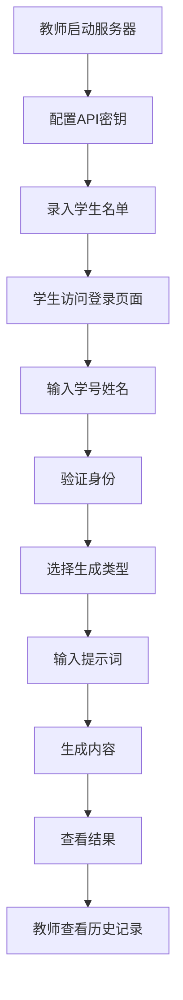

## 1. Product Overview
AI授课网站是一个为中小学信息科技教师设计的AIGC教学工具，通过局域网部署，无需学生登录即可体验文本、图像、视频生成等功能。
- 解决教师在机房上课时无法完成账号登录的问题，让学生能够充分体验AIGC技术。
- 为中小学生提供安全、便捷的AI生成体验，助力信息科技课程教学。

## 2. Core Features

### 2.1 User Roles
| Role | Registration Method | Core Permissions |
|------|---------------------|------------------|
| 教师 | 无需注册，直接访问配置页面 | 配置API密钥、管理学生名单、管理生成历史、查看使用统计 |
| 学生 | 输入学号和姓名，与教师录入的名单比对 | 使用文本、图像、视频生成功能 |

### 2.2 Feature Module
1. **生成页面**: 文本生成、图像生成、视频生成功能
2. **配置页面**: API密钥管理、模型设置、系统配置
3. **历史记录页面**: 查看生成历史、管理生成内容

### 2.3 Page Details
| Page Name | Module Name | Feature description |
|-----------|-------------|---------------------|
| 登录页面 | 学生登录 | 输入学号和姓名，与教师录入的名单比对，验证身份 |
| 生成页面 | 文本生成 | 支持输入提示词，选择模型参数，生成文本内容 |
| 生成页面 | 图像生成 | 支持输入图像描述，选择风格和尺寸，生成图像 |
| 生成页面 | 视频生成 | 支持输入视频描述，选择时长和风格，生成视频 |
| 配置页面 | API密钥管理 | 配置大模型API密钥，支持多种模型提供商 |
| 配置页面 | 模型设置 | 设置默认模型参数，调整生成质量和速度 |
| 配置页面 | 系统配置 | 设置服务器端口，局域网访问权限，使用限制 |
| 配置页面 | 学生名单管理 | 录入、编辑、导入学生名单，支持批量操作 |
| 历史记录页面 | 生成历史 | 查看所有学生的对话内容和生成历史，支持按学生、类型、时间筛选 |
| 历史记录页面 | 内容管理 | 管理生成的内容，支持删除和导出 |

## 3. Core Process
### 教师流程
1. 教师在教师机启动服务器
2. 访问配置页面，输入API密钥
3. 调整模型设置和系统配置
4. 录入学生名单（学号和姓名）
5. 学生通过局域网访问登录页面
6. 教师查看生成历史和使用统计

### 学生流程
1. 通过浏览器访问局域网地址
2. 输入学号和姓名进行登录
3. 系统验证身份（与教师录入的名单比对）
4. 登录成功后，选择生成类型（文本/图像/视频）
5. 输入提示词或描述
6. 点击生成按钮
7. 查看生成结果
8. 可选择重新生成或调整参数

## 4. User Interface Design
### 4.1 Design Style
- 主色调：蓝色(#165DFF)和白色(#FFFFFF)，辅助色：浅灰(#F5F7FA)
- 按钮样式：圆角矩形，有轻微的阴影效果
- 字体：无衬线字体，主标题18-24px，正文14-16px
- 布局风格：卡片式布局，清晰的视觉层次
- 图标风格：简约线性图标，搭配适当的颜色

### 4.2 Page Design Overview
| Page Name | Module Name | UI Elements |
|-----------|-------------|-------------|
| 生成页面 | 导航栏 | 顶部导航，包含生成类型切换（文本/图像/视频），教师入口链接 |
| 生成页面 | 输入区域 | 大文本框，提示词输入，参数调整滑块和下拉选择 |
| 生成页面 | 生成按钮 | 突出的蓝色按钮，带有加载动画 |
| 生成页面 | 结果区域 | 响应式卡片，显示生成结果，支持复制和下载 |
| 配置页面 | API配置 | 表单输入，密钥加密存储提示，测试连接按钮 |
| 配置页面 | 模型设置 | 滑块和下拉选择，实时预览效果 |
| 历史记录页面 | 历史列表 | 卡片式列表，包含生成类型、时间、预览图 |
| 历史记录页面 | 筛选器 | 日期范围选择，类型筛选，搜索框 |

### 4.3 Responsiveness
- 采用桌面优先设计，同时支持平板和手机等移动设备
- 在小屏幕设备上，布局自动调整为垂直堆叠
- 触摸设备优化：增大按钮点击区域，支持触摸滑动

### 4.4 3D Scene Guidance
- 无3D场景需求
