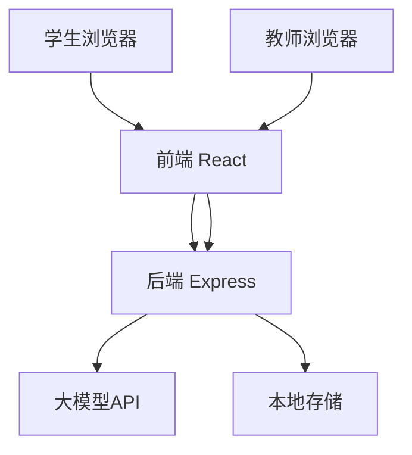
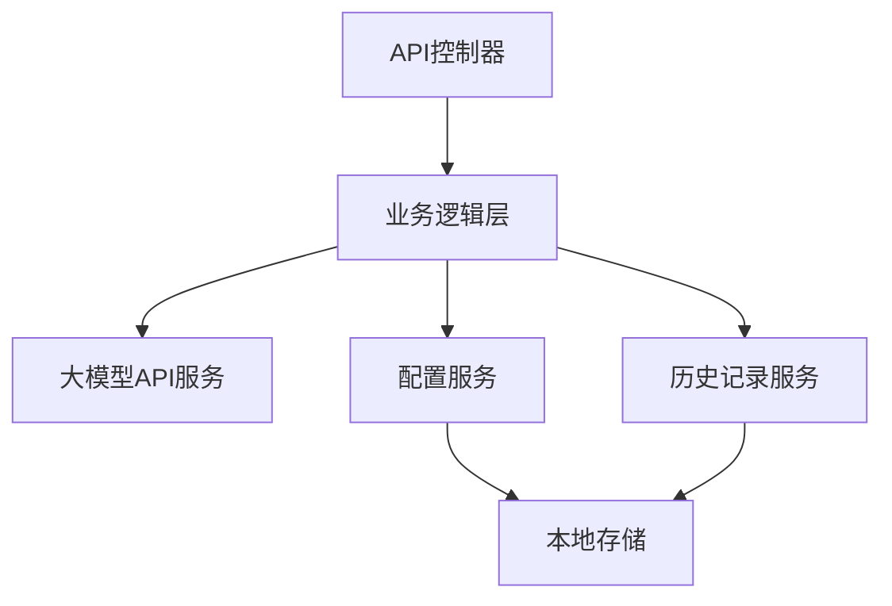
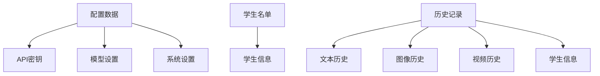

## 1. Architecture Design


## 2. Technology Description
- Frontend: React@18 + tailwindcss@3 + vite
- Initialization Tool: vite-init
- Backend: Express@4
- Database: 本地文件存储（JSON格式）
- External Services: 大模型API（如OpenAI、DeepSeek等）

## 3. Route Definitions
| Route | Purpose |
|-------|---------|
| / | 登录页面，学生身份验证 |
| /text | 文本生成页面 |
| /image | 图像生成页面 |
| /video | 视频生成页面 |
| /config | 配置页面，教师访问 |
| /history | 历史记录页面 |

## 4. API Definitions
### 4.1 后端API
| Endpoint | Method | Description | Request Body | Response |
|----------|--------|-------------|-------------|----------|
| /api/auth/login | POST | 学生登录验证 | {studentId: string, name: string} | {success: boolean, token: string, error: string} |
| /api/students | GET | 获取学生名单 | N/A | {success: boolean, data: array, error: string} |
| /api/students | POST | 添加学生 | {studentId: string, name: string} | {success: boolean, error: string} |
| /api/students | PUT | 更新学生 | {id: string, studentId: string, name: string} | {success: boolean, error: string} |
| /api/students | DELETE | 删除学生 | {id: string} | {success: boolean, error: string} |
| /api/text/generate | POST | 生成文本 | {prompt: string, model: string, parameters: object, studentId: string} | {success: boolean, data: string, error: string} |
| /api/image/generate | POST | 生成图像 | {prompt: string, model: string, parameters: object, studentId: string} | {success: boolean, data: string, error: string} |
| /api/video/generate | POST | 生成视频 | {prompt: string, model: string, parameters: object, studentId: string} | {success: boolean, data: string, error: string} |
| /api/config | GET | 获取配置 | N/A | {apiKeys: object, modelSettings: object, systemSettings: object} |
| /api/config | POST | 更新配置 | {apiKeys: object, modelSettings: object, systemSettings: object} | {success: boolean, error: string} |
| /api/history | GET | 获取历史记录 | N/A | {success: boolean, data: array, error: string} |
| /api/history | DELETE | 删除历史记录 | {id: string} | {success: boolean, error: string} |

### 4.2 前端API调用
- 使用fetch API调用后端接口
- 处理流式响应（如文本生成）
- 错误处理和加载状态管理

## 5. Server Architecture Diagram


## 6. Data Model
### 6.1 数据模型定义


### 6.2 数据结构
#### 配置数据
```typescript
interface Config {
  apiKeys: {
    openai?: string;
    deepseek?: string;
    [key: string]: string | undefined;
  };
  modelSettings: {
    defaultModel: string;
    temperature: number;
    maxTokens: number;
    imageSize: string;
    videoDuration: number;
  };
  systemSettings: {
    port: number;
    allowLanAccess: boolean;
    rateLimit: number;
  };
}
```

#### 学生数据
```typescript
interface Student {
  id: string;
  studentId: string;
  name: string;
  createdAt: number;
}

#### 历史记录数据
```typescript
interface HistoryItem {
  id: string;
  type: 'text' | 'image' | 'video';
  prompt: string;
  parameters: object;
  result: string;
  timestamp: number;
  model: string;
  studentId: string;
  studentName: string;
}
```

### 6.3 数据存储
- 配置数据存储在 `config.json` 文件中
- 学生数据存储在 `students.json` 文件中
- 历史记录存储在 `history.json` 文件中
- 使用文件系统读写操作进行数据持久化
- 定期备份数据文件
